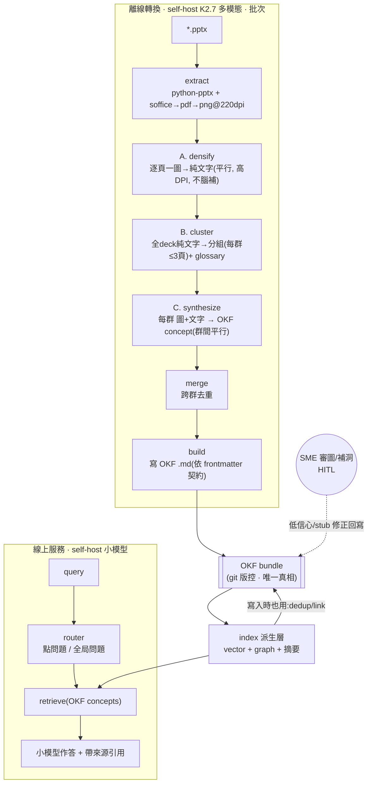
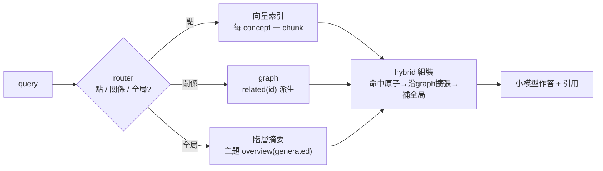
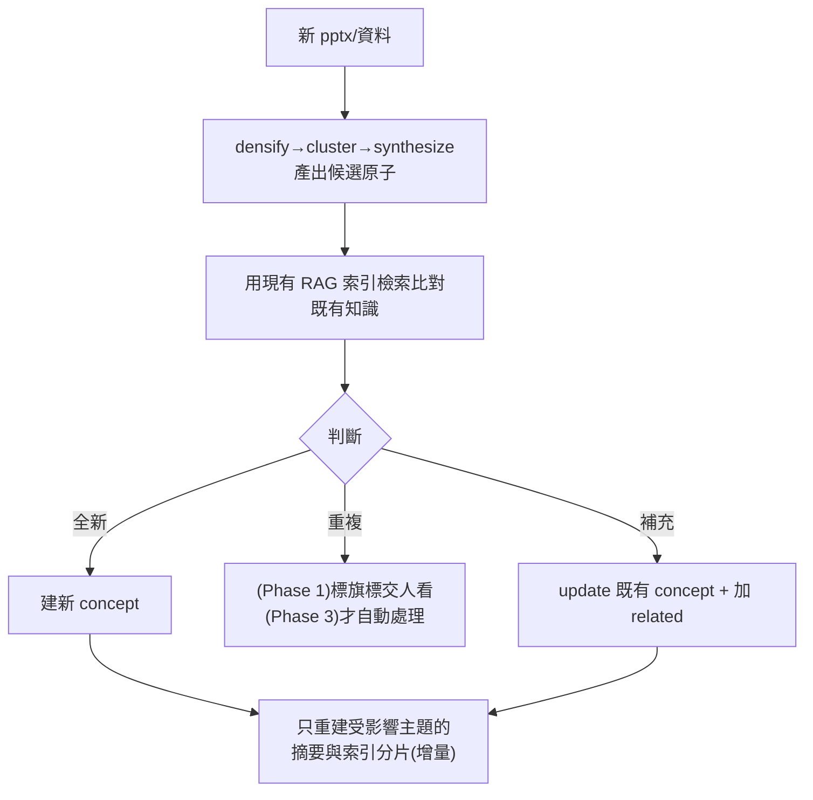

# DSLLM 知識庫架構

把大量半導體投影片(pptx)一點一點轉成一個**持續長大的知識庫**,同時提供:
- **OKF 細顆粒**形式(權威、結構化、人和 agent 都能讀)
- **RAG 粗顆粒**形式(語意檢索,給線上小模型用)

離線轉換用 self-host **Kimi K2.7**(多模態);線上用 self-host 小模型。全程內網、自簽 CA(`SSL_VERIFY` 控)。

---

## 0. 核心原則

> **OKF = 唯一真相(source of truth)。RAG(向量 + 圖 + 摘要)= 從 OKF 派生、可隨時重建的索引,不是第二份知識。**

一旦這樣定,「粗細兩形式如何整合」這題就消失了——它們是**同一份 OKF 的多解析度投影(想成 mipmap)**:

| 解析度 | 來源(全部派生自 OKF) | 服務的問題 |
|---|---|---|
| **細** | 每個 concept `.md` → chunk → 向量 | 點問題:「delamination 成因?」 |
| **關係** | frontmatter 的 `related`(用 id)→ graph | 遍歷:「哪些缺陷跟 molding 有關?」 |
| **粗** | 每個主題 → 自動生 overview 摘要 concept → 向量 | 全局:「整個封裝流程?」 |

查詢時 router 判斷粗/細,答案可**先命中粗摘要 → 沿連結鑽進細 concept**。粗細天生連通,因為都掛在同一份 OKF 上。

---

## 1. 全系統



---

## 2. 離線轉換 pipeline(已建 ✅)

專為「**沒講者備註、內容多是截圖/圖形拼成的解釋圖**」的 deck 設計 → vision 為主力,python-pptx 只當校正錨點。

| 階段 | 模組 | 做什麼 | 為何這樣切 |
|---|---|---|---|
| extract | `extract.py` | 抽文字/表格/備註 + 每頁渲染高 DPI 圖 | 一次渲染,A/C 共用 |
| **A densify** | `densify.py` | 逐頁「一圖」→ 榨成純文字(平行) | 單張圖 vision 注意力集中,小字/尺寸讀最準;榨完變便宜文字 |
| **B cluster** | `cluster.py` | 全 deck 純文字一次看 → 分組 + glossary | 文字便宜,50+ 頁不爆;每群≤3頁(prompt+程式雙保險) |
| **C synthesize** | `synthesize.py` | 每群「圖+文字」一起寫 concept(群間平行) | 看到整群才寫出「大於各頁總和」;densify文字當檢查清單 |
| merge | `synthesize.py` | 跨群合併明顯重複 | 分組後群多獨立,不用序列 rolling(避免 drift) |
| build | `build.py` | 寫成 OKF `.md` | |

驗證岔路:`run.py --dump-only` 只跑 A+B,落地 `debug/` 供人工看,**不燒 Stage C 的 vision token**。

---

## 3. OKF frontmatter 契約(我們自己掌控的真正 schema)

OKF spec 只要求 `type`;下面是**我們的擴充契約**,大部分防呆都在這裡:

```yaml
id: cpt_7f3a9c            # 永不變亂數 ID;連結/識別都用它,不用 slug
type: Failure Mode        # OKF 必填
title: ...                # 可改,不當識別碼
slug: ...                 # 只是檔名
generated: false          # true=衍生物(摘要),不可當真相、可重建
content_hash: sha256:...  # 內容指紋,判斷索引要不要重算
confidence: high | low    # 低=含未核對數值
provenance:               # 來源可回溯,合併時累積不丟
  - "file://deckA.pptx#slide=13"
related: [ cpt_1a2b, cpt_9x8y ]   # 用 id 連,不用 slug
model: kimi-k2.7@2026-06          # 產出模型版本,可重現/追責
```

> ⚠️ OKF v0.1 是 Google 2026-06 發布的未定稿 spec。我們把 **OKF-the-spec 當寬鬆容器**,把**上面這份 frontmatter 當真正的契約**——它由我們掌控,改動要進版控。

---

## 4. 知識分兩層

| 層 | 是什麼 | 半導體例子 | 存法 |
|---|---|---|---|
| **原子(單點)** | 具體事實/單元 | delamination 成因、EMC 的 Tg、wire bond 參數 | 一個 concept `.md` |
| **織網(全局)** | 跨原子的結構與關係 | 術語表、製程流程序、缺陷↔製程因果、JEDEC 標準、概觀 | **也是 concept**,結構型 type + `related` 連結;摘要標 `generated: true` |

粒度定案:**concept = 單點(`.md`);bundle = 知識域(對應 product line / 製程模組)+ 一個 global bundle。不做「每原子一個 bundle」**(對「大量餵、慢慢長」是過度設計)。

---

## 5. 索引與檢索



- **向量**:bge-m3 / Qwen3-Embedding(self-host)→ Qdrant / pgvector
- **graph**:邊從 frontmatter `related`(id)派生,零額外儲存
- **摘要**:每個主題目錄自動生 overview concept(答全局問題)
- **線上小模型**:未定,Qwen3-14B/32B-Instruct(要帶投影片圖再上 VL)

---

## 6. 增量策展迴路(「一點一點建立」)

關鍵洞見:**索引不只查詢時用,寫入時也要用**,才能長而不亂。



> 這就是 memory 系統的模式(存前先查、更新而非重複、用連結串)放大到知識庫規模。模型角色從「一次性轉換器」升級成**持續策展者**。

---

## 7. 技術債 / 陷阱與對策

### 現在就得防(便宜防、以後補很貴)

| # | 陷阱 | 對策 |
|---|---|---|
| ① | 標題衍生 slug 當識別碼 → 改名/合併後 `related` 全 dangling,graph 爛 | **穩定亂數 `id`,連結用 id 不用 slug** |
| ② | 摘要(派生物)與真相混在同一 store | `generated: true`;衍生物只能程式重建、不進 dedup 比對 |
| ③ | 派生索引 staleness(刪/改後索引沒同步 → 靜默錯答) | `content_hash` 只重算變動項;定期全量 reconcile 對帳 |
| ④ | 寫入時自動合併=有損、不可逆、順序相依(誤判重複=**靜默資料流失**) | **Phase 1 先 append-only + 疑似重複只標旗標**;自動策展延後;寧可連結不合併、絕不硬刪、每決定寫 log |
| ⑤ | vision 錯值汙染真相,越下游越難抓 | `confidence` + `provenance` 貫穿到底、合併時累積;答案帶引用;低信心檢索降權 |

### 可接受 / 記錄即可

| 風險 | 為何可接受 |
|---|---|
| OKF v0.1 spec 會變 | 本質 md+frontmatter,鎖定極低;真正契約是我們自訂欄位(§3) |
| K2.7 改版 → 同 pptx 產不同 OKF | `log.md` 記模型+prompt 版本,能追不能免 |
| 策展迴路呼叫成本 | Phase 3 才發生,屆時量測 |

### Process 債
**沒有 eval 就是盲飛。** 增量、模型驅動的庫會靜默劣化 → **現在就攢一個小的 golden Q→期望答案 集**,每次改動跑一下。

---

## 8. 分階段落地

| Phase | 做什麼 | 產出價值 | 狀態 |
|---|---|---|---|
| **0** | pptx→OKF 轉換 pipeline | 產出 OKF | ✅ 已建、已推 |
| **1** | frontmatter 契約 + 扁平向量 RAG + facet;**append-only、不自動合併、疑似重複標旗標** | 點問題馬上能答,低債可重現 | ⬜ 下一步 |
| **2** | id 連結 graph + 主題摘要(標 generated) | 全局/關係問題能答,粗細打通 | ⬜ |
| **3** | 增量策展迴路(寫入時 dedup/link + 局部重建) | 大量餵而庫不亂、持續長大 | ⬜ 前提:穩定 id + eval + 證實重複是問題 |

> 降債關鍵:**危險的自動化(④⑤)往後推**。Phase 1 用 append-only 就把 ①②③⑤ 的債防掉、④ 靠延後避開。

---

## 元件狀態

| 區塊 | 狀態 |
|---|---|
| extract / A / B / C / merge / build | ✅ 已建、已推(`yiting-tom/DSLLM`) |
| `--dump-only` 驗證 | ✅ |
| OKF frontmatter 契約(§3) | ✅ Phase 1 |
| 向量 RAG ingest(append-only、增量) | ✅ Phase 1 |
| facet 過濾(type/tags/confidence/generated) | ✅ Phase 1 |
| 疑似重複標旗標(唯讀,取代自動合併) | ✅ Phase 1 |
| golden eval harness(recall@k、假 embedder 自測) | ✅ Phase 1(骨架;真題待領域專家) |
| graph + 摘要 | ⬜ Phase 2 |
| 增量策展迴路 | ⬜ Phase 3 |
| HITL 補洞 | ⬜ |
